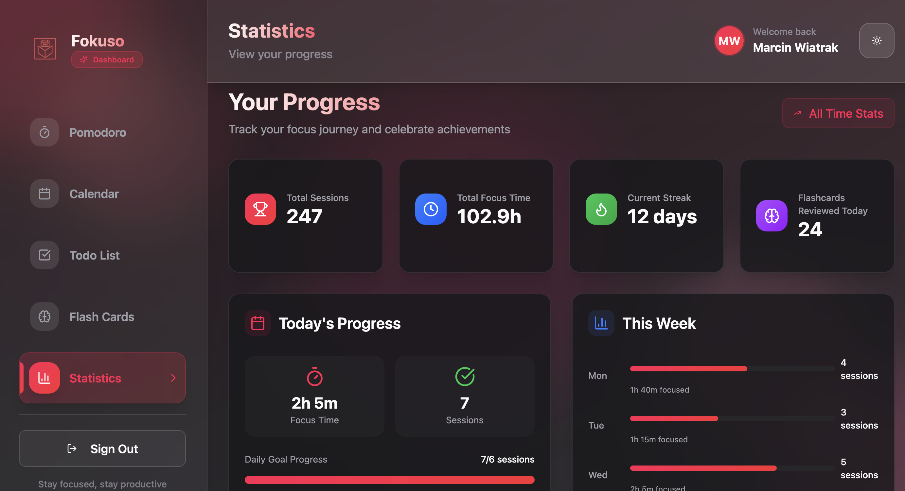
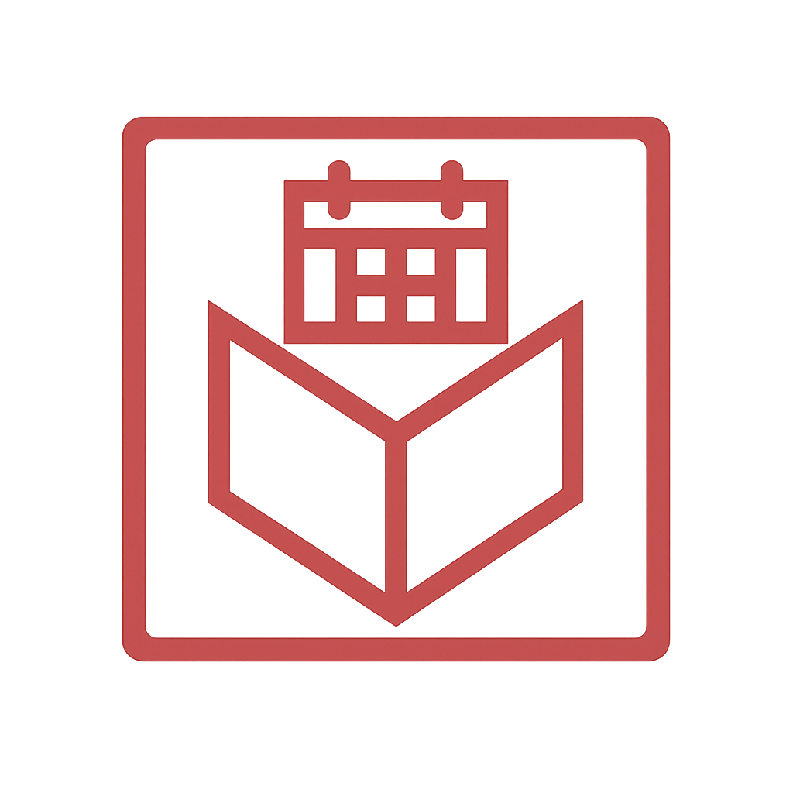

# 🎯 Fokuso

**Transform your productivity with intelligent study systems**

<div align="center">



[](https://reactjs.org/)
[](https://vitejs.dev/)
[](https://tailwindcss.com/)
[](https://djangoproject.com/)

[✨ Features](#-features) • [🚀 Quick Start](#-quick-start) • [🛠️ Tech Stack](#%EF%B8%8F-tech-stack) • [📁 Project Structure](#-project-structure) • [🤝 Contributing](#-contributing)

</div>

---

## 📖 About

<div align="center">
  
</div>

Fokuso is a comprehensive productivity platform designed to enhance your learning experience through scientifically-proven techniques. Built with modern web technologies, it combines the power of the Pomodoro Technique, spaced repetition learning, and intelligent task management to help you achieve peak focus and productivity.

Whether you're a student, professional, or lifelong learner, Fokuso provides the tools you need to:

- 🎯 **Master Focus** with customizable Pomodoro sessions
- 🧠 **Learn Efficiently** through spaced repetition flashcards
- 📅 **Stay Organized** with intelligent calendar and task management
- 📊 **Track Progress** with detailed analytics and insights

---

## ✨ Features

### 🍅 **Pomodoro Timer**

- **Smart Sessions**: Customizable focus and break durations
- **Preset Configurations**: Classic, Extended, Quick Sprint, and Ultradian rhythms
- **Audio Notifications**: Multiple sound options (Bell, Chime, Gong)
- **Session Tracking**: Comprehensive statistics and progress monitoring
- **Keyboard Shortcuts**: Seamless control with hotkeys

### 🧠 **Intelligent Flashcards**

- **Spaced Repetition System**: SM-2 algorithm for optimal memory retention
- **Deck Management**: Organize cards by subjects and topics
- **Learning Analytics**: Track mastery progress and review statistics
- **Adaptive Scheduling**: Smart review timing based on performance
- **Rich Content Support**: Text-based cards with tagging system

### 📅 **Smart Calendar**

- **Event Management**: Create, edit, and organize your schedule
- **Session Integration**: Automatic logging of focus sessions
- **Visual Overview**: Monthly view with color-coded event types
- **Quick Actions**: Fast event creation and editing
- **Progress Tracking**: Monitor daily and weekly productivity

### ✅ **Advanced Todo System**

- **Priority Management**: High, medium, and low priority levels
- **Category Organization**: Work, personal, health, education, and more
- **Due Date Tracking**: Never miss important deadlines
- **Tag System**: Flexible organization with custom tags
- **Progress Analytics**: Completion rates and productivity insights

### 📊 **Comprehensive Analytics**

- **Real-time Dashboard**: Live productivity metrics
- **Progress Visualization**: Charts and graphs for insights
- **Achievement System**: Gamified productivity milestones
- **Trend Analysis**: Long-term productivity patterns

### 🎨 **Modern User Experience**

- **Responsive Design**: Perfect on desktop, tablet, and mobile
- **Dark/Light Themes**: Comfortable viewing in any environment
- **Intuitive Interface**: Clean, distraction-free design
- **Progressive Web App**: Install and use offline

---

## 🚀 Quick Start

### Prerequisites

Before you begin, ensure you have the following installed:

- **Node.js** (v18 or higher)
- **npm** or **yarn**
- **Git**

### Installation

1. **Clone the repository**

   ```bash
   git clone https://github.com/lowskydev/Fokuso.git
   cd Fokuso
   ```

2. **Install dependencies**

   ```bash
   npm install
   ```

3. **Set up environment variables**

   ```bash
   cp .env.example .env
   # Edit .env with your configuration
   ```

4. **Start the development server**

   ```bash
   npm run dev
   ```

5. **Open your browser**
   ```
   Navigate to http://localhost:5173
   ```

### Production Build

```bash
# Build for production
npm run build

# Preview production build
npm run preview
```

---

## 🛠️ Tech Stack

### **Frontend**

- **⚛️ React 19** - Modern UI library with latest features
- **🔥 Vite 6** - Lightning-fast build tool and dev server
- **🎨 TailwindCSS 4** - Utility-first CSS framework
- **🎭 Radix UI** - Unstyled, accessible UI primitives
- **📊 Recharts** - Composable charting library
- **🗂️ Zustand** - Lightweight state management
- **🎯 React Hook Form** - Performant forms with validation
- **📅 Date-fns** - Modern date utility library

### **UI Components & Styling**

- **shadcn/ui** - High-quality component system
- **Lucide React** - Beautiful SVG icons
- **Class Variance Authority** - Component variant management
- **Tailwind Merge** - Intelligent class merging
- **Sonner** - Toast notifications

### **Development Tools**

- **ESLint** - Code linting and quality
- **PostCSS** - CSS processing
- **Path Aliases** - Clean import statements

### **Backend Integration**

- **Django REST API** - Robust backend framework
- **PostgreSQL** - Reliable database system
- **Token Authentication** - Secure user sessions

---

## 📁 Project Structure

```
src/
├── 📁 components/                # Reusable UI components
│   ├── 📁 calendar/              # Calendar-specific components
│   ├── 📁 flashcards/            # Flashcard system components
│   ├── 📁 layouts/               # Page layout components
│   ├── 📁 pages/                 # Route page components
│   ├── 📁 pomodoro/              # Timer components
│   ├── 📁 statistics/            # Analytics components
│   ├── 📁 todo/                  # Task management components
│   ├── 📁 ui/                    # Base UI primitives
│   └── 📁 theme-provider.jsx     # Theme context
│
├── 📁 store/                     # State management
│   ├── 📄 useAuthStore.js        # Authentication state
│   ├── 📄 useCalendarStore.js    # Calendar data
│   ├── 📄 useFlashcardStore.js   # Flashcard system
│   └── 📄 useTodoStore.js        # Todo management
│
├── 📄 App.jsx                    # Main application component
├── 📄 main.jsx                   # Application entry point
└── 📄 index.css                  # Global styles
```

### **Key Architecture Decisions**

- **Component-Based Architecture**: Modular, reusable components
- **Feature-First Organization**: Components grouped by functionality
- **Custom Hooks**: Shared logic extraction for reusability
- **Centralized State**: Zustand stores for global application state
- **Type Safety**: Comprehensive prop validation and error boundaries

---

## 🎮 Usage Guide

### **Getting Started**

1. **Create Your Account**

   - Sign up with email and password
   - Access your personalized dashboard

2. **Set Up Your First Pomodoro**

   - Choose from preset configurations or customize your own
   - Start your focus session and let Fokuso guide you

3. **Create Flashcard Decks**

   - Organize your learning materials by subject
   - Add cards with questions and answers
   - Let the spaced repetition algorithm optimize your learning

4. **Manage Your Tasks**
   - Add todos with priorities and due dates
   - Categorize tasks for better organization
   - Track your completion progress

### **Pro Tips**

- 🎯 **Use keyboard shortcuts** for faster navigation
- 📊 **Check your statistics** weekly to track progress
- 🔄 **Combine techniques** - study with flashcards during Pomodoro sessions
- 🎨 **Customize your theme** for the best visual experience

---

## 🎨 Theming & Customization

Fokuso supports extensive customization through:

- **CSS Custom Properties**: Easy color scheme modifications
- **TailwindCSS Configuration**: Utility class customization
- **Component Variants**: Flexible component styling
- **Responsive Design**: Seamless experience across devices

---

## 🤝 Contributing

We love contributions! Here's how you can help make Fokuso even better:

### **How to Contribute**

1. **Fork the repository**
2. **Create a feature branch** (`git checkout -b feature/amazing-feature`)
3. **Commit your changes** (`git commit -m 'Add amazing feature'`)
4. **Push to the branch** (`git push origin feature/amazing-feature`)
5. **Open a Pull Request**

### **Development Guidelines**

- Follow the existing code style and conventions
- Write meaningful commit messages

---

## 👥 Contributors

<table>
  <tr>
    <td align="center">
      <a href="https://github.com/contributor1">
        
        <br />
        <sub><b>Contributor 1</b></sub>
      </a>
      <br />
      <sub>🎯 Product Vision</sub>
    </td>
    <td align="center">
      <a href="https://github.com/contributor2">
        
        <br />
        <sub><b>Contributor 2</b></sub>
      </a>
      <br />
      <sub>🎨 UI/UX Design</sub>
    </td>
    <td align="center">
      <a href="https://github.com/contributor3">
        
        <br />
        <sub><b>Contributor 3</b></sub>
      </a>
      <br />
      <sub>⚡ Backend Development</sub>
    </td>
    <td align="center">
      <a href="https://github.com/contributor4">
        
        <br />
        <sub><b>Contributor 4</b></sub>
      </a>
      <br />
      <sub>🧪 Quality Assurance</sub>
    </td>
  </tr>
</table>

---

## 📄 License

This project is licensed under the **MIT License** - see the [LICENSE](LICENSE) file for details.

---

## 🙏 Acknowledgments

- **Francesco Cirillo** for the Pomodoro Technique
- **Piotr Wozniak** for the SM-2 spaced repetition algorithm
- **Radix UI** for accessible component primitives
- **TailwindCSS** for the utility-first CSS framework

---

<div align="center">

**Made with ❤️ by the Fokuso team**

[⬆ Back to top](#-fokuso)

</div>
